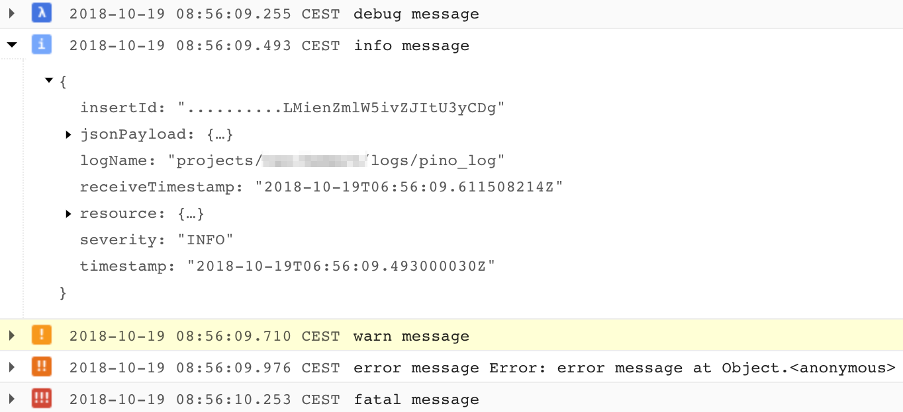

# pino-stackdriver

[](https://travis-ci.com/ovhemert/pino-stackdriver)
[](https://ci.appveyor.com/project/ovhemert/pino-stackdriver)
[](https://app.codacy.com/app/ovhemert/pino-stackdriver?utm_source=github.com&utm_medium=referral&utm_content=ovhemert/pino-stackdriver&utm_campaign=Badge_Grade_Dashboard)
[](https://snyk.io/test/npm/pino-stackdriver)
[](https://coveralls.io/github/ovhemert/pino-stackdriver?branch=master)
[](https://greenkeeper.io/)
[](http://standardjs.com/)

This module provides a "transport" for [pino][pino] that forwards messages to the [Google Stackdriver][stackdriver] log service through it's API.



You should install `pino-stackdriver` globally for ease of use:

```bash
$ npm install --production -g pino-stackdriver
```

## Requirements

This package internally uses the Google cloud logging library to call the Stackdriver Logging API. To be able to log to Stackdriver, some setup is needed on the Google Cloud platform.

Create a service account on the page [Stackdriver Logging Client Libraries](https://cloud.google.com/logging/docs/reference/libraries). This downloads a JSON file with the credentials required.

## Installation

To use globally from command line:

```bash
$ npm install -g pino-stackdriver
```

To include as a library in your project:

```bash
$ npm install pino-stackdriver
```

## CLI

Want to use `pino-stackdriver` from the CLI?
See the [CLI](./docs/CLI.md) documentation for details.

## API

Want to use `pino-stackdriver` as a library in your project?
See the [API](./docs/API.md) documentation for details.

## Maintainers

Osmond van Hemert
[](https://github.com/ovhemert)
[](https://ovhemert.dev)

## Contributing

If you would like to help out with some code, check the [details](./docs/CONTRIBUTING.md).

Not a coder, but still want to support? Have a look at the options available to [donate](https://ovhemert.dev/donate).

## License

Licensed under [MIT](./LICENSE).

[pino]: https://www.npmjs.com/package/pino
[stackdriver]: https://cloud.google.com/logging/
